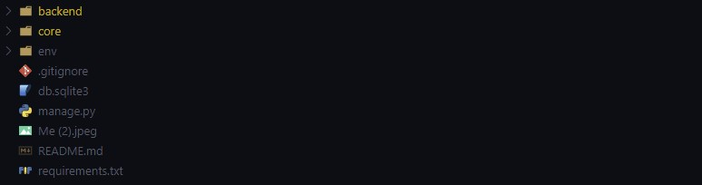

### Backend

To run the backend, please ensure that you have python installed locally in your system/laptop.

    To check if you have python installed, open cmd and
        run:
            python --version

    If it's installed, you will see the python version installed i.e: 3.11.4

To run the backend project, cd (change directory) into the project folder.

    cd backend

Inside the project directory you will see folders and files arranged as shown below

After that, you can run the project by typing thr following commands in cmd/command prompt

    run:
        python3 -m venv env                # to create the virtual environment for this project
        env/Scripts/activate               # to activate the virtual environment (works only in windows)
        pip install -r requirements.txt    # to install dependencies used to build the project in the virtual environment
        python manage.py runserver         # to start the server (it runs on port 8000 by default)

For Linux based system user, the command to activate virtual environment wont work, to solve that
follow the following steps.

    1. delete env (virtual environemnt) folder
    2. cd into project folder and run the following command to create a virtual environment (call it env) work in Linux based system.

    run:
       python -m venv env

To run the project, follow type the following commands below

    run:
        source env/bin/activate            # to activate the virtual environment (works only in Linux based system)
        pip install -r requirements.txt    # to install dependencies used to build the project in the virtual environment
        python manage.py runserver         # to start the server (it runs on port 8000 by default)

### Frontend

To run the frontend, please ensure that you have node js installed locally in your system/laptop.

Before doing anything cd (change directory) into frontend folder, by run the following command

    cd frontend

Inside the project directory you will see folders and files arranged as shown below

After that, run the following commands to run the frontend app

    - npm install
    - npm install -g vite      #vite is a build tool and development server that provides fast, efficient, and lightweight development and building processes in JS framework.
    - npm install react-spinners # to add a spinner (it occurs when a server is down)
    - npm run dev

